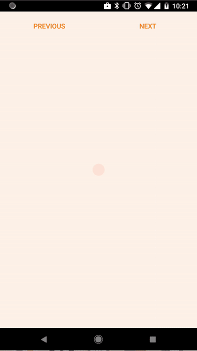

#  spritz

_Animate your view pager with Lottie and zero efforts._


--------

Spritz is an Android library to seamlessly trigger a Lottie animation when the user drags a `ViewPager` or changes page programmatically.
It supports animating while swiping and auto-playing when the swipe is complete.

Get the demo here:

<a href="https://play.google.com/store/apps/details?id=com.novoda.spritz.sample" style="border-bottom: 0px solid;">
    
</a>

Here's how our demo looks like:



## How to use

### Basics

Each step in the `ViewPager` has two possible animations:

- a "swipe away" animation that will be triggered while the user drags from one page to the next or previous one
- an "autoplay" animation segment that plays as soon as the user enters the destination page

When swiping forward, the animation will stop right before auto-playing. When swiping backwards, instead, the animation will stop at the end of the
previous page's autoplay animation, so it doesn't play again since that page is in an "already visited" state.

### Lottie Animation

To learn how to create a Lottie-compatible animation from After Effects, please read 
[our blog post "Whole Lottie Love"](https://www.novoda.com/blog/whole-lottie-love/), which contains basic instructions on how to export an animation
into a Lottie-supported format.

Your animation should have:

- for each page, a "swipe away" animation
- for each page, optionally, an "autoplay" animation segment

These segments must be consecutive to one another, as if the user continuously moves to one page to another.

### Code!

After getting your `LottieAnimationView` and your `ViewPager`, just create a `Spritz` object with the following syntax:

```java
Spritz spritz = Spritz
                    .with(lottieAnimationView)
                    .withSteps(
                            new SpritzStep.Builder()
                                    .withAutoPlayDuration(500, TimeUnit.MILLISECONDS)
                                    .withSwipeDuration(500, TimeUnit.MILLISECONDS)
                                    .build(),
                            new SpritzStep.Builder()
                                    .withAutoPlayDuration(500, TimeUnit.MILLISECONDS)
                                    .withSwipeDuration(500, TimeUnit.MILLISECONDS)
                                    .build(),
                            new SpritzStep.Builder()
                                    .withAutoPlayDuration(500, TimeUnit.MILLISECONDS)
                                    .build()
                    )
                    .build();
```

Once you have your `Spritz` instance, you need to simply attach it to the `ViewPager`, and start any pending animation. If you're working in an 
`Activity`, you would normally do it in `onStart`:

```java
@Override
protected void onStart() {
    super.onStart();
    spritz.attachTo(viewPager);
    spritz.startPendingAnimations();
}
```

When you're done with your view, detach the `Spritz` instance from the `ViewPager`:

```java
@Override
protected void onStop() {
    spritz.detachFrom(viewPager);
    super.onStop();
}
```

### Animation durations

`Spritz` handles multiple types of animations for your view.

**Note:** this library assumes that the first set animation on the first page starts from the time 0, and that all animations are in the order
`[autoplay (optional) 0 - swipe 0 - ... - swipe (n-1) - autoplay (optional) n]` and are consecutive to each other.

#### Autoplay animation

The autoplay animation is an optional animation that is launched automatically as soon as the `ViewPager` successfully transition to a new page.
You simply need to set (using `withAutoPlayDuration` on the page builder) how long the autoplay animation lasts in your After Effects project, 
`Spritz` will take care of the rest.

Please note that the autoplay animation is always played after the user swipes forward, it is not played when the user swipes back, since the 
"swipe back" action sets the Lottie progress to the end of the previous autoplay animation.

#### Swipe animation

The swipe animation is started and progressed as the user drags the view pager back and forth. To set the duration of a page swipe animation, use
`withSwipeDuration`. This animation is not optional, since it's what this library has been created for :P.

## License

```
   Copyright 2017 Novoda

   Licensed under the Apache License, Version 2.0 (the "License");
   you may not use this file except in compliance with the License.
   You may obtain a copy of the License at

     http://www.apache.org/licenses/LICENSE-2.0

   Unless required by applicable law or agreed to in writing, software
   distributed under the License is distributed on an "AS IS" BASIS,
   WITHOUT WARRANTIES OR CONDITIONS OF ANY KIND, either express or implied.
   See the License for the specific language governing permissions and
   limitations under the License.
```
